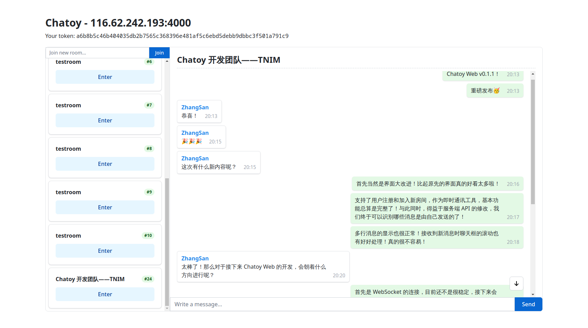

## Chatoy Web

Here is a simple web client for the project Chatoy.

### Preview



### Usage

Install dependencies:

```bash
pnpm install
```

Start the development server:

```bash
pnpm dev
```

Build the project:

```bash
pnpm build
```

And then you can deploy the `dist` folder to your server!
